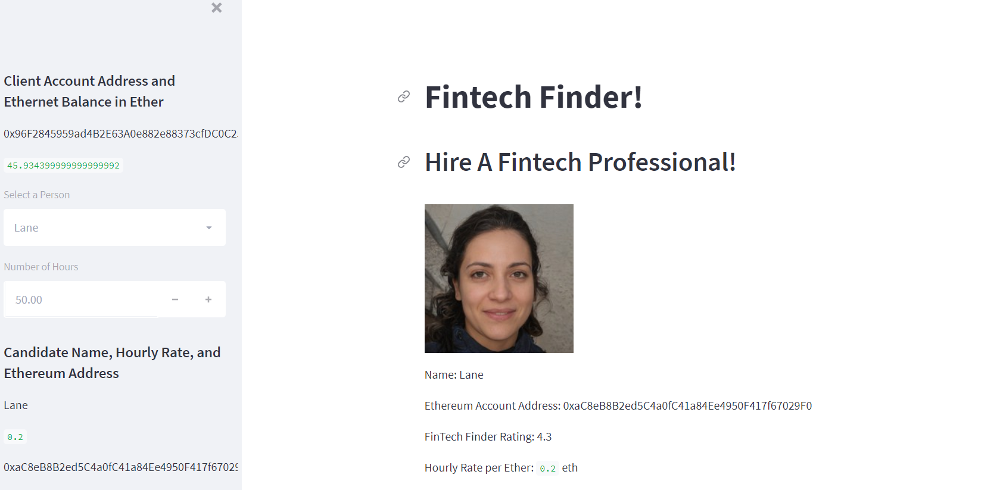
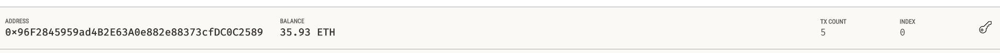
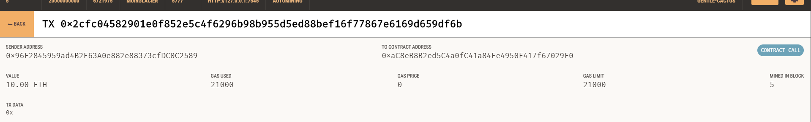

# Cryptocurrency-Wallet
## Done by Nedal Mahanweh 

### in this Project we will build a Platform called Fintech-Finder whish is an application that is customers can use to find Fintech Professionals from amomg list of Candidates , hire them, and pay them. By integreting the Ethereum network blockchain network into the application in order to enable the Cusomers to instanly pay the fintech professionals whome they hire with cryptocurrency. 

### Files 
* Fintech_finder
* crypto_wallet 
* Images 

### step 1: Import Ethereum Transaction Functions into the Fintech Finder Application

in this section, we will import several functions from the crypto_wallet.py script into the file fintech_finder.py, which contains code for Fintech Finder’s customer interface,in order to add wallet operations to the application. 

### Step 2: Sign and Execute a Payment Transaction
we'll write the code that will calculate a fintech professional’s wage, in ether, based on the worker’s hourly rate and the number of hours that they work for a customer

### Step 3: Inspect the Transaction

we will send a test transaction by using the application’s web interface, and then look up the resulting transaction in Ganache

### Address balance and history on Ganache

###  Transaction details on Ganache
 